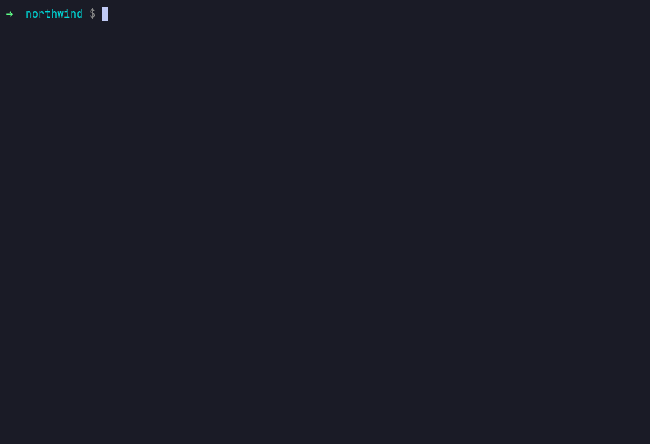

# Agentic Platform Engineering Extravaganza

[](LICENSE)
[](https://github.com/open-policy-agent/opa)
[](https://github.com/open-policy-agent/conftest)
[](https://github.com/score-spec/score-k8s)
[](https://modelcontextprotocol.io)
[](src/build_report.py)
[](.github/workflows/cluster.yaml)
[](https://codespaces.new/adventurewave-labs/agentic-platform-engineering-extravaganza?quickstart=1)
[](https://vercel.com/new/clone?repository-url=https%3A%2F%2Fgithub.com%2Fadventurewave-labs%2Fagentic-platform-engineering-extravaganza)

> Hand a capable model one sentence — *"a PCI-scope payments service with a Postgres database,
> EU residency, staging and prod"* — and it returns Kubernetes manifests that apply cleanly and
> fail **42 policy checks across 12 rules**. Route the same sentence through a golden path, a provisioner set, a
> policy bundle and an authorization model, and it converges to **zero** in three iterations,
> inside budget, with a human still holding the production approval.
>
> **The agent is not the platform.** This repository is that comparison, executable.


Every policy verdict below came from running the real `conftest` binary against the real Rego in
[`policy/`](policy/). Every manifest came from running the real `score-k8s` binary against the
provisioner set in [`platform/`](platform/). Run it twice and the numbers are identical.

---

## Table of contents

- [Why this exists](#why-this-exists)
- [Quick start](#quick-start)
- [The eight acts, and a scorecard](#the-eight-acts-and-a-scorecard)
- [The idea worth stealing: authz-gated MCP](#the-idea-worth-stealing-authz-gated-mcp)
- [The policy bundle](#the-policy-bundle)
- [Point your own agent at it](#point-your-own-agent-at-it)
- [The stack, and why each piece is here](#the-stack-and-why-each-piece-is-here)
- [What is real and what is a fixture](#what-is-real-and-what-is-a-fixture)
- [Repository layout](#repository-layout)
- [Extending it](#extending-it)
- [Research notes](#research-notes)

---

## Why this exists

The interesting question in 2026 is not whether an AI agent can write a Kubernetes manifest. It
obviously can. The question is what happens to your estate when a few hundred engineers each have
one, and the answer depends almost entirely on what the agent is allowed to render into.

Three numbers frame it:

| | |
|---|---|
| **68% / 50%** | of developers save 10+ hours a week with AI — and lose 10+ hours a week to organisational inefficiency. Developers spend **16%** of their time writing code. <br><sub>Atlassian, *State of DevEx 2025*, n=3,500, fielded March 2025</sub> |
| **"negligible"** | DORA's 2025 finding on what AI does for organisational performance **when platform quality is low**. Platform engineering is the moderator, not a nice-to-have. <br><sub>DORA, *State of AI-assisted Software Development 2025*, ~5,000 respondents</sub> |
| **57% / 61%** | of engineers still wait on a human or a ticket to get an environment; 61% call environment provisioning a major roadblock. <br><sub>Rafay-commissioned survey, 500+ practitioners, 2023</sub> |

The bottleneck moved to exactly where platform engineers already live. That is the opportunity —
and the risk, because an agent inherits whatever the platform gives it. A golden path makes an
agent boringly correct. Its absence makes an agent a very fast junior engineer with production
credentials and no supervision.

**This demo argues that agentic platform engineering needs _more_ platform engineering, not less**
— and then proves the claim by running the tools rather than describing them.

---

## Quick start

No accounts, no API keys, no cluster, no cloud. Python 3.10+ and about ninety seconds.

### In a browser — GitHub Codespaces

[](https://codespaces.new/adventurewave-labs/agentic-platform-engineering-extravaganza?quickstart=1)

The dev container installs PyYAML, fetches the pinned upstream binaries and runs the
acceptance suite before it hands you a prompt, so the first thing you see is 14/14 passing.
Then:

```bash
./run.sh demo
```

### On your machine

```bash
git clone https://github.com/adventurewave-labs/agentic-platform-engineering-extravaganza
cd agentic-platform-engineering-extravaganza

./run.sh setup     # fetch the pinned upstream binaries (conftest, score-k8s, kube-linter)
./run.sh demo      # the full run: eight acts and a scorecard
./run.sh verify    # 15 acceptance checks against real tool output
./run.sh test      # 68 unit tests, stdlib only, no extra dependencies
```

`run.sh` checks your Python version and installs the one dependency it needs if it is
missing, rather than raising a traceback out of an import.

Other entry points:

```bash
./run.sh act 5                 # just the policy gate and the remediation loop
./run.sh tools cost-reviewer   # the MCP tool list a read-only agent receives
./run.sh gate outputs/final-manifests.yaml
./run.sh mcp 8099              # the platform MCP server, streamable HTTP
./run.sh drift                 # the day-2 drift agent
./run.sh site                  # the showcase page on :8080
make help                      # everything, with descriptions
```

The showcase page reads in English and Spanish — the switch is in the nav, it follows
`navigator.language` on a first visit, and it remembers your choice. Terminal output,
YAML and shell commands stay in the original on purpose: those are verbatim
`conftest`, `score-k8s` and `kube-linter` output, and translating them would be the
one fabricated thing on a page that argues nothing here is fabricated. `make site-build`
refuses to render when the English and `site/i18n.es.json` have drifted apart, so the
two languages cannot end up making different claims.

Or with Docker:

```bash
docker compose run --rm demo
docker compose run --rm verify
docker compose up site         # http://localhost:8080
docker compose up mcp          # http://localhost:8099/mcp
```

---

## The eight acts, and a scorecard

<table>
<tr><th width="90">Act</th><th>What happens</th></tr>

<tr><td><b>I</b><br><sub>the problem</sub></td><td>
One sentence becomes six tickets across six teams: platform, security, cloud-infra, network,
FinOps, release engineering. <b>Eleven working days.</b> About four hours of that is work. The rest
is queue.
</td></tr>

<tr><td><b>II</b><br><sub>no platform</sub></td><td>
Give the sentence to a capable model and ask for manifests. What comes back is not stupid — it is
<i>plausible</i>. It parses, it applies, it would pass a distracted review. Conftest and kube-linter
return <b>42 denials</b>:

<table>
<tr><td><code>NW-K8S-003</code> ×10</td><td>no owner, no cost centre, no data classification — nobody can even tell who this belongs to</td></tr>
<tr><td><code>NW-K8S-002</code> ×6</td><td>no resource requests or limits on any container</td></tr>
<tr><td><code>NW-K8S-004</code> ×6</td><td>may run as root, writable root filesystem, capabilities not dropped</td></tr>
<tr><td><code>NW-K8S-005</code> ×4</td><td>no liveness or readiness probes</td></tr>
<tr><td><code>NW-K8S-001</code>, <code>-008</code> ×2 each</td><td><code>:latest</code> tags, from an unapproved registry</td></tr>
<tr><td><code>NW-K8S-006</code> ×2</td><td>a literal database password in the pod spec</td></tr>
<tr><td>5× <code>KL-*</code> ×2 each</td><td>the same failures, independently confirmed by kube-linter</td></tr>
</table>

Worth noticing what is <i>not</i> in that list. The PCI rules never fire, and neither does the
production availability floor — because those rules key off labels
(<code>northwind.io/data-classification</code>, <code>northwind.io/environment</code>) that the
unguided output does not carry. <b>An unlabelled workload does not merely fail your compliance
checks; it is invisible to them.</b> Getting <code>NW-K8S-003</code> right is what makes the other
fourteen rules able to see the thing at all.
<br><br>
Nothing in that prompt told the model what PCI means at Northwind, which registry is approved, or
that this cost centre has $400 a month. That knowledge is not in any model. It is in a platform.
</td></tr>

<tr><td><b>III</b><br><sub>the platform API</sub></td><td>
The agent connects over MCP as a <i>principal</i>, and receives <b>12 of 14 tools</b>. It queries
the catalog, reads the agent fleet as <code>AiResource</code> entities, and lists the golden paths.
<a href="#the-idea-worth-stealing-authz-gated-mcp">The two tools it does not receive are the point.</a>
</td></tr>

<tr><td><b>IV</b><br><sub>render</sub></td><td>
<code>resources: {db: {type: postgres}}</code> — the entire database request a developer writes —
becomes a Crossplane v2 namespaced composite with encryption, a private endpoint, sized backups and
a cost-centre tag, because <a href="platform/northwind.provisioners.yaml"><code>platform/northwind.provisioners.yaml</code></a>
says that is what "postgres" means here. Swap that file and every service in the estate gets the
new definition on its next render.
<br><br>
The platform also injects, unasked: hardened security context, dropped capabilities, read-only
rootfs, probes, topology spread, a PodDisruptionBudget, a default-deny NetworkPolicy, no automounted
service-account token, and ownership labels on every object. <b>Every Act II violation with exactly
one correct answer is now structurally impossible, and no model was consulted about any of it.</b>
</td></tr>

<tr><td><b>V</b><br><sub>the gate</sub></td><td>
What the platform <i>cannot</i> decide for you is judgement: how big, which region, how long to keep
backups, how much to spend. The agent read "high volume at peak" and picked
<code>db.r6g.xlarge</code>, multi-AZ, 500 GiB — $960.82/mo against a $400 envelope — and left the
backup window at the 7-day default inside PCI scope.
<br><br>
Three real conftest evaluations later it is at zero. Each denial carries its own remediation after
<code>-&gt;</code>; the agent reads that, <b>changes the input</b>, and the whole artefact is
regenerated. It never edits rendered output to make a check go green — that is the failure mode
that makes automated remediation worse than none, because the finding returns silently on the next
render.
</td></tr>

<tr><td><b>VI</b><br><sub>money</sub></td><td>
$960.82 → $359.15/mo. <b>$602/mo on one service</b>, caught before anything was provisioned. And the
backup window went the <i>other</i> way, 7 days to 30, because the cost gate is not allowed to win
an argument with the PCI gate.
</td></tr>

<tr><td><b>VII</b><br><sub>propose, then stop</sub></td><td>
The agent opens a pull request whose body carries the policy verdict and the cost delta — the
reviewer sees evidence, not a diff to audit by hand. Then it tries to approve its own production
promotion, and the platform declines. Not the model declining: the <i>platform</i>.
</td></tr>

<tr><td><b>VIII</b><br><sub>day two</sub></td><td>
Four weeks on. 18 replicas instead of 6 (<code>kubectl scale</code> at 02:14, never reconciled;
12 extra × $16.43 = <b>$197/mo</b>, priced from the same rate card as everything else here). The PCI backup window silently cut to 7 days by a legacy Terraform pipeline. The
NetworkPolicy gone for fifteen days after a namespace was recreated. All attributed, all proposed
as a diff — the drift agent holds no tool that can mutate a cluster, so when it is wrong, and it
will be, git is still the truth.
</td></tr>

<tr><td><b>—</b><br><sub>scorecard</sub></td><td>
Eleven working days of queue → a couple of seconds of compute. 6 handoffs → 1. 42 violations → 0.
$602/mo recovered. Zero cluster mutations by any agent, by construction.
<br><br>
The scorecard deliberately does not print a speed-up multiple. Eleven days against two seconds is a
number in the hundreds of thousands, and it would be arithmetically true and rhetorically
worthless — those eleven days were never work. What actually changed is that the waiting is gone
and the review got better evidence.
</td></tr>
</table>

### Act V — the policy gate, and the agent closing it

Real OPA denials, read and acted on. Three iterations, zero at the end. Nothing here is
scripted: the same `conftest` binary you would run in CI produces every line.


### Act III — the tool an agent is never told about

The same MCP server, two identities, two different worlds. `platform.approve_promotion`
is not refused at call time; it is absent from the list.


### Act IV — three lines of Score become a Crossplane composite

`resources: {db: {type: postgres}}` in, encrypted-and-tagged managed database out — because
`platform/northwind.provisioners.yaml` says that is what "postgres" means here.


### Act VIII — day two, with attribution

18 replicas where git says 6. The PCI backup window silently cut to 7 days. The NetworkPolicy
gone for fifteen days. Detected, attributed, and proposed as a diff — never applied.



The complete eight-act run is [`gifs/wow.gif`](gifs/wow.gif) (7.5 MB). Every `.cast` is in
[`recordings/`](recordings/) and plays with `asciinema play recordings/wow.cast`.

---

## The idea worth stealing: authz-gated MCP

If you take one thing from this repository, take this.

Every tool the platform exposes declares a permission, and `tools/list` is **filtered by the calling
identity before the model ever sees it**:

```console
$ ./run.sh tools platform-agent
identity: agent:platform-agent  (12/14 tools visible)

    catalog.get_entity                 catalog:read
    catalog.query                      catalog:read
    catalog.refresh_entity             catalog:refresh
  ! catalog.register                   catalog:write
    platform.estimate_cost             finops:read
    platform.evaluate_policy           policy:evaluate
  ! platform.open_pull_request         delivery:propose
    platform.plan_promotion            delivery:plan
    platform.render_workload           platform:render
  ! scaffolder.execute                 scaffolder:execute
    scaffolder.get_template_parameters scaffolder:read
    scaffolder.list_templates          scaffolder:read

  withheld from this identity:
    x platform.approve_promotion       identity lacks delivery:approve
    x platform.detect_drift            identity lacks observability:read
```

<sub><code>!</code> marks a tool that writes. Run it yourself — that block is copied from the
command's actual output, not retyped.</sub>

An agent without `delivery:approve` is **not instructed to avoid** approving production. It is never
told the capability exists. A system prompt that says "never approve production" is a request that
can be argued with. An empty tool list is a fact that cannot.

Two layers, deliberately:

1. **Identity → actions.** Twelve platform actions in [`src/catalog.py`](src/catalog.py), granted
   per principal. `platform-agent` holds `delivery:propose` and never `delivery:approve`.
2. **`AiResource.spec.allowedTools`.** A git-tracked, owned, reviewable
   [catalog entity](platform/catalog/ai-resources.yaml) that narrows an agent further. **An agent's
   blast radius is a YAML file a human reviews and an auditor can diff** — not a prompt edit, not a
   toggle in a vendor console.

```yaml
apiVersion: backstage.io/v1alpha1
kind: AiResource
metadata:
  name: platform-agent
spec:
  type: agent
  owner: group:default/platform-team
  identity: platform-agent
  # The blast radius: twelve entries, and note which one is absent.
  allowedTools:
    - catalog.query
    - catalog.get_entity
    - catalog.refresh_entity
    - catalog.register
    - scaffolder.list_templates
    - scaffolder.get_template_parameters
    - scaffolder.execute
    - platform.render_workload
    - platform.evaluate_policy
    - platform.estimate_cost
    - platform.plan_promotion
    - platform.open_pull_request
    # platform.approve_promotion is not here, and never will be.
```

Four identities ship, and they receive genuinely different worlds — try each:

```bash
./run.sh tools platform-agent    # 12/14 — can propose, cannot approve
./run.sh tools drift-agent       #  5/14 — read-mostly, cannot mutate a cluster at all
./run.sh tools cost-reviewer     #  3/14 — strictly read-only
./run.sh tools release-manager   # 14/14 — a human in the owning group
```

**Credit where it is due:** this pattern is lifted from
[OpenChoreo](https://github.com/openchoreo/openchoreo) (Apache-2.0, CNCF Sandbox), whose control
plane routes every MCP tool call through the same policy decision point that governs human API
access — see `pkg/mcp/tools/*.go`. It is the only OSS internal developer platform I found that does
this, and it deserves far more attention than it gets.

---

## The policy bundle

Twenty-five controls across four bundles — 34 `deny`/`warn` rule bodies — all real Rego, all
evaluated by conftest.

| Bundle | Rules | Covers |
|---|---|---|
| [`policy/kubernetes/workload.rego`](policy/kubernetes/workload.rego) | `NW-K8S-001…008` | immutable image refs, resource envelopes, ownership and cost labels, restricted pod security, probes, no plaintext credentials, production availability floor, approved registries |
| [`policy/kubernetes/pci.rego`](policy/kubernetes/pci.rego) | `NW-PCI-001…006` | default-deny networking both directions, encrypted storage, 30-day backup floor, no public database endpoints, EU data residency, audit sink, no automounted service-account token |
| [`policy/cost/budget.rego`](policy/cost/budget.rego) | `NW-FIN-001…006` | cost-centre envelope, no production-grade instances outside production, no unreviewed single line item over 70%, cost-allocation tags, no multi-AZ in non-prod, spend-spike warning |
| [`policy/score/workload_spec.rego`](policy/score/workload_spec.rego) | `NW-SCORE-001…005` | required platform annotations, supported resource types only, credentials by reference, declared resource envelope, residency declared for PCI |

Every message is shaped so an agent can act on it:

```
[NW-PCI-003] SQLInstance/nw-payments-ledger-prod: backupRetentionDays=7 is below the
             30-day PCI floor -> set spec.parameters.backupRetentionDays>=30
```

The `->` half is what makes the loop agentic rather than merely a linter. The agent parses it, maps
it to a Score parameter, and re-renders. **If a denial cannot be mapped back to an input, the agent
escalates rather than papering over it** — see `unresolved()` in [`src/agent.py`](src/agent.py).

Run the bundle against anything you like:

```bash
./bin/conftest test --policy policy/ your-manifests.yaml
```

---

## Point your own agent at it

The MCP server is a real one — MCP `2025-06-18`, stdio and streamable HTTP, stdlib only.

```bash
# stdio
claude mcp add northwind -- python3 src/platform_mcp.py

# or HTTP
./run.sh mcp 8099
claude mcp add --transport http northwind http://127.0.0.1:8099/mcp
```

See [`examples/mcp.json`](examples/mcp.json) for Cursor, Copilot and other clients.

Then ask it for a service. It will list the golden paths, read the parameter schema, render,
evaluate, remediate, and stop at the pull request — because that is the last thing its identity is
permitted to do.

<details>
<summary><b>The fourteen tools</b></summary>

| Tool | Permission | Does |
|---|---|---|
| `catalog.query` | `catalog:read` | search entities by kind, owner, tag or text |
| `catalog.get_entity` | `catalog:read` | fetch one entity in full |
| `catalog.refresh_entity` | `catalog:refresh` | re-queue and read back fresh state — this is what closes the scaffold→verify loop |
| `catalog.register` | `catalog:write` | register or update an entity |
| `scaffolder.list_templates` | `scaffolder:read` | the golden paths on offer |
| `scaffolder.get_template_parameters` | `scaffolder:read` | JSON Schema for a template |
| `scaffolder.execute` | `scaffolder:execute` | run a golden path; renders Score, manifests, Argo CD, Kargo |
| `platform.render_workload` | `platform:render` | Score spec → manifests via score-k8s |
| `platform.evaluate_policy` | `policy:evaluate` | run the real policy bundle |
| `platform.estimate_cost` | `finops:read` | Infracost-shaped estimate per environment |
| `platform.plan_promotion` | `delivery:plan` | what moves, what gates it, who must approve |
| `platform.open_pull_request` | `delivery:propose` | propose the change |
| `platform.approve_promotion` | `delivery:approve` | **no agent identity holds this** |
| `platform.detect_drift` | `observability:read` | observed vs desired, with attribution |

`catalog.refresh_entity` mirrors the catalog refresh action Backstage added in the v1.54.0
line (`catalog:refresh-entity`), which exists precisely so an agent can scaffold something and immediately read the catalog's view of
it instead of racing the processing loop. Without it the agentic golden path does not close.

</details>

---

## The stack, and why each piece is here

Everything is free, open source and currently maintained. `./bin/setup.sh` fetches official release
artefacts at pinned versions — nothing is vendored or reimplemented.

| Project | Role here | License | Version | Agentic surface today |
|---|---|---|---|---|
| [Conftest](https://github.com/open-policy-agent/conftest) / [OPA](https://github.com/open-policy-agent/opa) | evaluates every verdict in this demo | Apache-2.0 | 0.69.0 / 1.19.1 | **the gate itself** |
| [score-k8s](https://github.com/score-spec/score-k8s) / [Score](https://github.com/score-spec/spec) | developer-facing spec; renders the manifests | Apache-2.0 | 0.16.0 | small schema'd YAML a model gets right |
| [kube-linter](https://github.com/stackrox/kube-linter) | independent second opinion | Apache-2.0 | 0.8.3 | verification |
| [Crossplane v2](https://github.com/crossplane/crossplane) | the platform API the provisioner renders into | Apache-2.0 | v2.4.0 | ⚠️ no official MCP server |
| [Backstage](https://github.com/backstage/backstage) | catalog + Software Template shape; `AiResource` | Apache-2.0 | v1.54.0 | **first-party MCP Actions backend** |
| [Argo CD](https://github.com/argoproj/argo-cd) | reconciles the merged change | Apache-2.0 | v3.5.1 | [`argoproj-labs/mcp-for-argocd`](https://github.com/argoproj-labs/mcp-for-argocd) |
| [Kargo](https://github.com/akuity/kargo) | promotion path with a human gate | Apache-2.0 | v1.11.2 | ⚠️ MCP proposal closed `not_planned` |
| [OpenChoreo](https://github.com/openchoreo/openchoreo) | source of the authz-gated MCP pattern | Apache-2.0 | v1.2.3 | **3 MCP servers, 3 in-tree agents** |
| [Trivy](https://github.com/aquasecurity/trivy) / [Checkov](https://github.com/bridgecrewio/checkov) / [OpenTofu](https://github.com/opentofu/opentofu) | optional scanners and IaC toolchain | Apache-2.0 / MPL-2.0 | 0.74.0 / 3.3.13 / 1.12.6 | optional |

**Deliberately excluded, with reasons** — because a survey that only lists winners is not a survey:

- **[Cyclops](https://github.com/cyclops-ui/cyclops)** (3.3k★) — genuinely nice idea, but last commit
  July 2025, and its MCP server has **no LICENSE file at all**.
- **[Kusion](https://github.com/KusionStack/kusion)** (1.3k★) — two commits in thirteen months.
- **[Port](https://www.getport.io/)** — closed-source core, `port-mcp-server` archived in favour of a
  hosted endpoint, AI agents behind a paid tier. Fails the free-and-OSS bar.
- **Community Crossplane MCP servers** — 0–2★ each, one archived. Not demo-grade. If you need
  agentic Crossplane today, drive it through the Kubernetes API or Backstage MCP Actions.

**Also worth your time, not used here:** [kagent](https://github.com/kagent-dev/kagent) (CNCF
Sandbox — agents as Kubernetes CRDs, the best *story* in this space),
[kubectl-ai](https://github.com/GoogleCloudPlatform/kubectl-ai) (7.5k★, first-class Ollama support),
[k8sgpt](https://github.com/k8sgpt-ai/k8sgpt) and [HolmesGPT](https://github.com/HolmesGPT/holmesgpt)
(both CNCF Sandbox — note HolmesGPT moved out of `robusta-dev/` into its own org),
[CAIPE](https://github.com/cnoe-io/ai-platform-engineering) + [idpbuilder](https://github.com/cnoe-io/idpbuilder)
(CNOE's multi-agent platform and the best "whole IDP on a laptop" experience),
and [Dagger](https://github.com/dagger/dagger)'s `LLM` primitive with two-way MCP.

---

## What is real and what is a fixture

A demo that overstates itself is worse than no demo. The line, drawn honestly:

| Component | Status | Detail |
|---|---|---|
| Policy evaluation | ✅ **real** | the pinned `conftest` binary over the Rego in `policy/`. Every number in this README comes from it. |
| Manifest rendering | ✅ **real** | the pinned `score-k8s` binary with the provisioner set in `platform/`. |
| kube-linter | ✅ **real** | an independent linter nobody here tuned. It found four genuine defects in the platform defaults during development — missing `containerPort`, no anti-affinity, an unresolvable ServiceAccount reference, and an unset `unhealthyPodEvictionPolicy`. All four were fixed **in the platform**, not worked around in the demo. |
| MCP server | ✅ **real** | MCP 2025-06-18, stdio + streamable HTTP. `./run.sh verify` exercises `initialize`, `tools/list`, `tools/call` and `resources/list`. |
| Authorization | ✅ **real** | enforced in code at `tools/list` and `tools/call`, not by prompt instruction. |
| The agent's reasoner | ⚠️ **deterministic by default** | denials are parsed and mapped to Score parameter changes by rules, so the demo reproduces exactly with no API key. `--backend llm` swaps in a real model against any OpenAI-compatible endpoint (Ollama, vLLM, OpenRouter, Z.AI, OpenAI itself); the loop is unchanged. **That it makes no difference to the outcome is the argument** — and T15 is that argument executed: it drives the loop through the LLM code path against a recorded transcript and asserts it lands on the same manifests and the same `$359.15`. |
| Intent extraction | ⚠️ **regex** | prose → structured request. A model does this better on messy input and worse on reproducibility. One function, replaced by `--backend`. |
| Kubernetes cluster | ⚠️ **not in the demo; real in CI** | `./run.sh demo` applies nothing anywhere — every claim it makes lives in rendering and evaluation. But "valid against a real cluster" is not left as an assertion: [`.github/workflows/cluster.yaml`](.github/workflows/cluster.yaml) stands up a pinned kind cluster, installs the platform API as a [CRD](platform/crds/sqlinstance.yaml), and puts the committed manifests through the real API server — schema validation, admission, defaulting — then asserts the controllers acted on them. It also runs the negative control: the same API server **accepts the unguided manifests too**, all 42 violations of them. |
| Cloud provisioning | ❌ **not present** | the `SQLInstance` is a real Crossplane-shaped composite; no Composition is installed, no cloud account is touched. |
| Cost figures | ⚠️ **static rate card by default** | a checked-in table in `src/costing.py`, so there is no account requirement and the artefacts stay byte-reproducible. "Swap in Infracost and the Rego does not change" is wired rather than asserted: `NORTHWIND_COST_SOURCE=infracost` re-prices the database and load-balancer lines against real cloud rates via [`src/sources/infracost.py`](src/sources/infracost.py), and every estimate carries a `costSource` so a rate-card number is never mistaken for a priced one. |
| Drift observation | ⚠️ **fixture by default** | `platform/observed-state.yaml`. Detection, attribution and the proposed patch are real code over that shape. `NORTHWIND_DRIFT_SOURCE=argocd` swaps the fixture for [`src/sources/argocd.py`](src/sources/argocd.py), which reads Argo CD's `managed-resources` for the desired/observed pair and `metadata.managedFields` for attribution — and reports a *field manager*, not a person, because that is all a control plane actually knows. |
| Northwind Retail | ❌ **fictional** | the company, the teams, the ticket numbers. The pain is not. |

`./run.sh verify` runs **15 acceptance checks** and is the thing to trust rather than this table: the toolchain
is present, the Rego compiles, the unguided path is still rejected (≥20 findings), the golden path
still converges to zero, kube-linter still finds nothing in the platform's output, the agent still
cannot approve production while a human still can, the MCP protocol still answers, the LLM backend
still reaches the same answer as the deterministic one, and the committed run record still reproduces
exactly (the unguided finding count and its per-policy breakdown, the iteration count, the cost before
and after, and the rendered object count).

`./run.sh test` runs **68 unit tests** underneath that — stdlib `unittest`, no new dependency. They
cover the branches the worked example never reaches: the intent extractor's whole surface, the
staging-only FinOps rules, an unmappable denial, a model that replies with prose instead of JSON, a
model that invents a field, and the Argo CD adapter's normalisation without an Argo CD. A system
check tells you the demo broke; a unit test tells you which function did it.

---

## Repository layout

```
.
├── index.html                          the showcase page (single file, no build step)
├── site/index.template.html            its source; regenerate with `make site-build`
├── site/i18n.es.json                   the Spanish half of the page, and the drift guard
│
├── policy/                             ← the part worth stealing first
│   ├── kubernetes/workload.rego        NW-K8S-001..008
│   ├── kubernetes/pci.rego             NW-PCI-001..006
│   ├── cost/budget.rego                NW-FIN-001..006
│   └── score/workload_spec.rego        NW-SCORE-001..005
│
├── platform/
│   ├── northwind.provisioners.yaml     ← and this second: what "postgres" means here
│   ├── observed-state.yaml             the day-2 drift fixture
│   ├── crds/sqlinstance.yaml           the platform API as a real CRD, for the cluster job
│   └── catalog/
│       ├── org.yaml                    Groups, Users, cost centres, budgets
│       ├── systems.yaml                Components, Resources, the platform API
│       ├── ai-resources.yaml           ← the agent fleet and its blast radius
│       └── templates/
│           └── golden-path-service-postgres/template.yaml
│
├── src/
│   ├── platform_mcp.py                 the MCP server — 14 tools, authz-filtered
│   ├── catalog.py                      catalog + the authorization model
│   ├── renderer.py                     both paths: no-platform, and the golden path
│   ├── gates.py                        thin wrappers over the real binaries
│   ├── agent.py                        intent extraction, remediation, LLM backends
│   ├── costing.py                      Infracost-shaped estimates
│   ├── driftd.py                       the day-2 drift agent
│   ├── sources/argocd.py               live observed state, instead of the fixture
│   ├── sources/infracost.py            real cloud prices, instead of the rate card
│   ├── goldenpath.py                   the eight-act orchestrator
│   ├── ui.py                           terminal presentation
│   ├── build_report.py                 the 15 acceptance checks, timed
│   ├── build_casts.py                  asciinema casts + GIFs from real runs
│   ├── build_playground.py             real gate results for the interactive page
│   └── build_site.py                   renders index.html from the template
│
├── outputs/                            committed artefacts from the last run
│   ├── run-record.json                 what `verify` checks against
│   ├── final-score.yaml                the developer-facing contract
│   ├── final-manifests.yaml            7 objects, 0 denials
│   ├── kargo-pipeline.yaml             Warehouse → staging → prod
│   ├── verify-report.json              the 15 checks, with real durations
│   └── playground.json                 recorded conftest output for the page
│
├── tests/                              68 unit tests + the fake OpenAI endpoint
│   ├── fake_llm.py                     replays a recorded transcript; no key, no spend
│   └── test_agent.py  test_gates.py  test_costing.py  test_drift.py
│
├── .github/workflows/
│   ├── verify.yaml                     the 15 checks + the unit tests, on a clean checkout
│   └── cluster.yaml                    a real kind cluster, and the negative control
│
├── recordings/  gifs/  captured/       demo assets, all regenerable
├── .devcontainer/                      one-click GitHub Codespaces
├── bin/setup.sh                        fetches the pinned upstream binaries
├── run.sh  Makefile  requirements.txt  entry points
├── LICENSE  NOTICE                    MIT; upstream licenses enumerated separately
└── Dockerfile  docker-compose.yml  vercel.json
```

---

## Extending it

**Change what "postgres" means.** Edit
[`platform/northwind.provisioners.yaml`](platform/northwind.provisioners.yaml) and re-run
`./run.sh demo`. Every service in the estate gets the new definition on its next render. This is the
whole leverage of platform engineering in one file, and it is the leverage an agent inherits for
free — the agent never has to know how to provision a database correctly, because the only database
it *can* ask for is the correct one.

**Add a policy.** Drop a `.rego` file in `policy/`. Give the message a `[POLICY-ID]` prefix and a
`-> how to fix it` suffix and the agent will act on it. Add a branch in `remediate()` in
[`src/agent.py`](src/agent.py) to map it to a Score parameter; leave it out and the agent will
correctly escalate instead of guessing.

**Add a golden path.** Copy the template directory. `scaffolder.list_templates` picks it up with no
code change.

**Change an agent's blast radius.** Edit `spec.allowedTools` in
[`platform/catalog/ai-resources.yaml`](platform/catalog/ai-resources.yaml). Confirm with
`./run.sh tools <identity>`. Note that this is a pull request, which is the point.

**Use a real model.**

```bash
export NORTHWIND_LLM_BASE_URL=http://127.0.0.1:11434/v1   # Ollama, vLLM, OpenRouter, Z.AI...
export NORTHWIND_LLM_MODEL=qwen2.5-coder:7b
./run.sh demo --backend llm
```

The loop is identical. If the model is any good, the outcome is identical too — because the platform,
not the model, is what determines it.

**Wire it to a real cluster.** Replace the fixture in `platform/observed-state.yaml` with output from
`argoproj-labs/mcp-for-argocd` or `containers/kubernetes-mcp-server`, install a Crossplane
Composition matching the `SQLInstance` XRD, and point `score-k8s` at your kubeconfig. Nothing in
`policy/` or `src/gates.py` changes.

---

## Research notes

The tool survey behind this repository was done in August 2026 against primary sources — GitHub
release pages, official docs, CNCF project pages. A few findings worth recording, because they are
easy to get wrong:

- **There is no official Kubernetes MCP server.** `kubernetes-sigs/mcp-server` does not exist.
  [`containers/kubernetes-mcp-server`](https://github.com/containers/kubernetes-mcp-server) is the
  de-facto leader and moved into the neutral `containers` org in July 2025 specifically for
  community governance — but per its own maintainer, standard-bearer status is "aspirational rather
  than established". Do not call it official.
- **kro moved.** It is `kubernetes-sigs/kro` now, a Kubernetes SIG Cloud Provider subproject — not
  CNCF, and no longer at `kro-run/kro`.
- **HolmesGPT moved** out of `robusta-dev/` into its own `HolmesGPT` GitHub org.
- **`akuity/argocd-mcp` moved** to `argoproj-labs/mcp-for-argocd`.
- **Kargo has no MCP server and is not getting one soon** — issue #6212 was closed `not_planned` in
  May 2026 and the accompanying PR closed unmerged.
- **Crossplane has no official MCP server.** A search of the repo for `modelcontextprotocol` returns
  nothing, and the community attempts are 0–2★ or archived.
- **The Pulumi local OSS MCP server appears discontinued** — the repo 404s and npm has been stale
  since September 2025; the documented path is now a hosted Pulumi Cloud endpoint.
- **There is no mature OSS "AI writes your Rego" tool.** That gap is arguably this repo's thesis:
  the valuable artefact is the policy a human wrote, not the policy a model generated.

---

## Related

- [**Agentic DevOps Extravaganza**](https://github.com/adventurewave-labs/agentic-devops-extravaganza)
  — the sibling repo: K8sGPT and Robusta doing autonomous incident triage against a real Kubernetes
  API and a real LLM.

## License

MIT — see [LICENSE](LICENSE). The upstream tools retain their own licenses (Apache-2.0 throughout,
except OpenTofu at MPL-2.0) and none of them are vendored here; they are enumerated in
[NOTICE](NOTICE).

Northwind Retail is fictional. The policy bundle, the provisioner set, the MCP server and every
verdict in this README are not.
